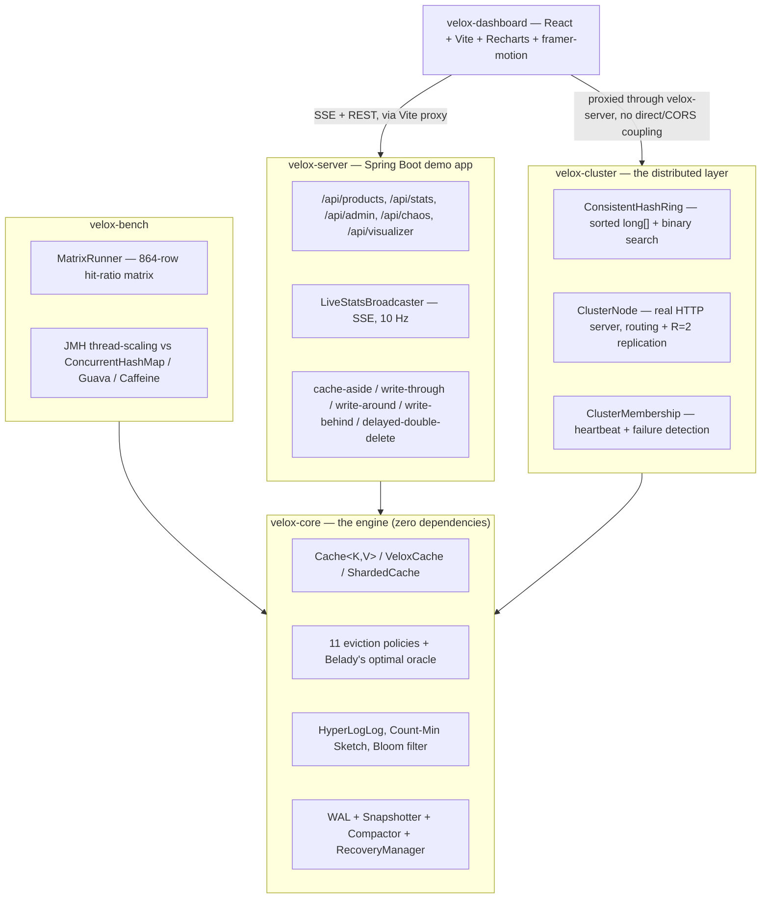

# VeloxCache

**A pluggable, observable, distributed caching engine, built entirely from scratch.**

The brief this started from is [LeetCode 146](https://leetcode.com/problems/lru-cache/): a hash
map plus a doubly linked list, ~60 lines, solvable in 25 minutes. VeloxCache treats that as the
core and builds a real system around it — 11 eviction policies measured against a provably
optimal offline oracle, a live dashboard that animates the cache's own internal data structures
in real time, a distributed layer with consistent hashing and replication, and a write-ahead
log with a genuine crash-recovery test. Zero third-party dependencies in the core engine —
every data structure here is hand-written and independently tested against a naive reference
implementation.

> 📸 **Dashboard screenshot/GIF goes here.** Recording a live capture is the one artifact this
> README can't generate for itself — see [Live dashboard](#live-dashboard) below for what it
> looks like running, and the 3-command quickstart to see it yourself.

---

## Quickstart

```bash
# 1. Build and test everything (Java 21, Maven — a vendored copy is in .tools/ if you don't have one)
mvn test

# 2. Start the demo server (Spring Boot, H2 in-memory by default, seeds a small catalog)
mvn -pl velox-server spring-boot:run

# 3. In a second terminal, start the dashboard
cd velox-dashboard && npm install && npm run dev
```

Open **http://localhost:5173**. The dashboard's seven tabs — Live Ops, Internals, Policy Arena,
Hot Keys, Cluster, Chaos, Benchmarks — are all wired to the real, running server; nothing is
mocked or pre-recorded.

To see the distributed layer, launch a few cluster nodes separately (a different module,
`velox-cluster`, deliberately independent of the demo server — see
[`ClusterNode`](velox-cluster/src/main/java/com/velox/cluster/ClusterNode.java)'s own Javadoc
for the exact commands) and point `velox.demo.cluster-seed` at one of them.

---

## Architecture



Four independent Maven modules plus one npm project, each with a single, disclosed reason to
depend on anything beyond the one below it — see [`docs/ARCHITECTURE.md`](docs/ARCHITECTURE.md)
for the full reasoning behind every boundary.

---

## What's built

Every tier below is **complete and tested**, not aspirational — the checkboxes in
[`PROJECT_PLAN.md`](PROJECT_PLAN.md) are the actual, current build log, updated as each
milestone landed, including the ones that didn't go as planned on the first try.

| Tier | What it is | Highlight |
|---|---|---|
| 0-1 | Core engine | O(1) get/put/evict, TTL via an indexed min-heap or a hierarchical timing wheel |
| 2 | Concurrency | Sharded cache, single-flight loading, measured thread-scaling |
| 3 | Smart eviction | 11 policies (LRU → W-TinyLFU) + Belady's optimal oracle as a ceiling |
| 4 | Benchmark lab | 864-row hit-ratio matrix, 8 workloads × 3 capacities × 3 seeds |
| 5 | Web server | Real Spring Boot app, 5 cache/DB integration patterns, measured 4.1× throughput |
| 6 | Live dashboard | 7 screens, all real-time via SSE — including an *animated* internals view |
| 7 | Distributed layer | Consistent hashing, real replication, real heartbeat failure detection |
| 8 | Durability | Write-ahead log, snapshotting, a genuine crash-recovery test |

**619 automated tests** across 4 modules, all passing.

---

## The headline numbers

Measured against a live, locally running server (`LoadGenerator`, a Zipfian-distributed HTTP
load generator — see [`docs/SYSTEM.md`](docs/SYSTEM.md#14-the-headline-numbers) for the exact
methodology and two disclosed caveats):

| Metric | Cache OFF | Cache ON (W-TinyLFU) | Result |
|---|---|---|---|
| Throughput | 1,350 req/s | 5,534 req/s | **4.1× ↑** |
| p50 latency | 19.2 ms | 3.5 ms | **5.5× ↓** |
| p99 latency | 311.0 ms | 24.0 ms | **13.0× ↓** |

Every online eviction policy was measured against Belady's **provably optimal** offline oracle
across 864 (policy × capacity × workload × seed) configurations — see
[`docs/benchmarks/RESULTS.md`](docs/benchmarks/RESULTS.md) for the full matrix, including an
honestly-investigated anomaly (ARC scoring ~0% on one adversarial workload, traced to its exact
mechanism rather than tuned away).

---

## Live dashboard

Seven screens, all driven by the same 10 Hz SSE stream from the real running server — nothing
pre-recorded:

- **Live Ops** — ops/sec, hit-rate sparkline, latency percentiles, capacity fill, per-shard load
- **Internals** — LRU/ARC/W-TinyLFU's *actual internal structure*, animated live, with a step
  mode to pause and narrate one operation at a time
- **Policy Arena** — all 11 eviction policies racing the identical live traffic stream, ranked
  by hit rate in real time
- **Hot Keys** — a HyperLogLog cardinality estimate + a Space-Saving top-K leaderboard
- **Cluster** — the distributed layer's node health, with a real kill-node button
- **Chaos** — stampede, scan-flood, mass-expiry, and cache-penetration buttons, each reporting
  its own before/after delta
- **Benchmarks** — an explorer over the Tier 4 hit-ratio matrix and thread-scaling CSVs

---

## Real bugs, found and fixed

Every one of these was caught by testing against something *real* — live traffic, a real
separate OS process, a real crash — not just the automated suite, and every one is disclosed in
[`PROJECT_PLAN.md`](PROJECT_PLAN.md) at the exact milestone where it was found:

1. **A concurrency bug** in the demo server: `CacheBuilder.build()` silently returns a
   single-threaded cache unless `.concurrencyLevel(n)` is set. Two caches were built without it
   and corrupted under real concurrent HTTP traffic — caught by the load generator, invisible to
   every unit test.
2. **A hash-quality bug** in the consistent-hash ring: plain FNV-1a produced ring points with
   *identical* top bits across a node's virtual copies, clustering them into one narrow arc
   instead of spreading around the ring (42% fairness std-dev against a 5% target). Fixed with a
   second avalanche pass.
3. **A process-exit bug**: a "graceful" node shutdown returned success but the process kept
   running — `HttpServer.stop()` doesn't shut down a custom executor, and the thread pool's
   worker threads were non-daemon. Caught only by actually killing a real separate process, not
   by the in-JVM integration tests.
4. **A memory-scaling bug** in crash recovery: replay collected the entire write-ahead log into
   a `List` before folding it into the recovered state, doubling peak memory. Caught by an
   actual 13.1-million-record, 1.5 GB crashed log file throwing `OutOfMemoryError` on a 2 GB
   heap. Fixed to stream records one at a time; re-verified against the same real crashed file.

---

## Project structure

```
velox-core/       the engine — cache, eviction policies, sketches, durability. Zero dependencies.
velox-bench/      JMH benchmarks + the hit-ratio matrix runner. The only module allowed 3rd-party deps.
velox-server/     Spring Boot demo app — real DB, real HTTP API, real SSE stream.
velox-cluster/    the distributed layer — consistent hashing, replication, heartbeat. JDK-only.
velox-dashboard/  React + Vite + TypeScript + Recharts + framer-motion.
docs/             architecture, algorithms, system design, and measured benchmark write-ups.
```

## Testing

```bash
mvn test                          # everything, all 4 Java modules
mvn -pl velox-core test           # just the core engine (526 tests)
cd velox-dashboard && npm run build   # type-checks the whole frontend
```

Every hand-written data structure carries its own `assertInvariants()`, run after every
mutation in every test (toggled off in production via a system property) — see
[`docs/ARCHITECTURE.md`](docs/ARCHITECTURE.md) for why that catches corruption the moment it
happens rather than three operations later when it becomes visible.

## Docs

- [`PROJECT_PLAN.md`](PROJECT_PLAN.md) — the full tier-by-tier build log, every milestone, every finding
- [`docs/ARCHITECTURE.md`](docs/ARCHITECTURE.md) — core engine, data structures, concurrency
- [`docs/ALGORITHMS.md`](docs/ALGORITHMS.md) — all 11 eviction policies + the Belady oracle
- [`docs/SYSTEM.md`](docs/SYSTEM.md) — the web server, dashboard, cluster, and durability layers
- [`docs/benchmarks/RESULTS.md`](docs/benchmarks/RESULTS.md) — the full hit-ratio matrix write-up
- [`docs/benchmarks/thread-scaling.md`](docs/benchmarks/thread-scaling.md) — concurrency benchmarks
