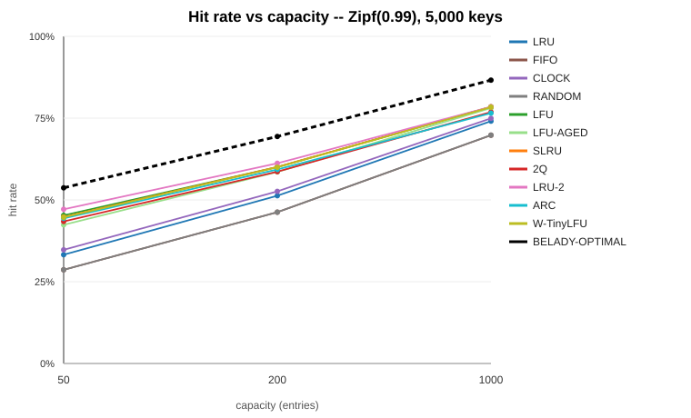
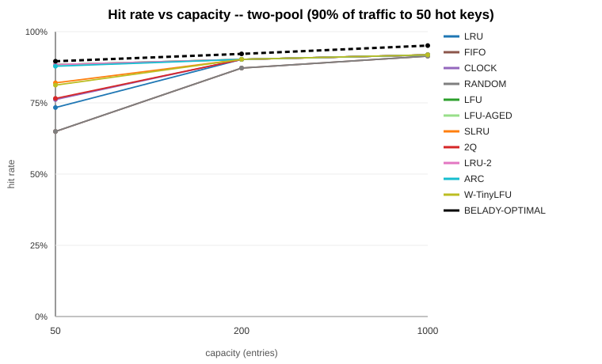
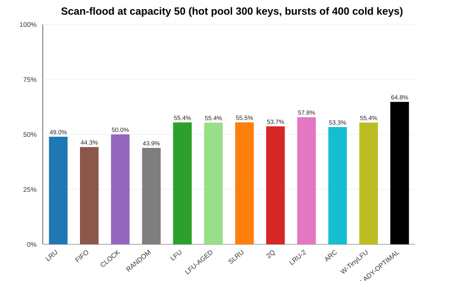
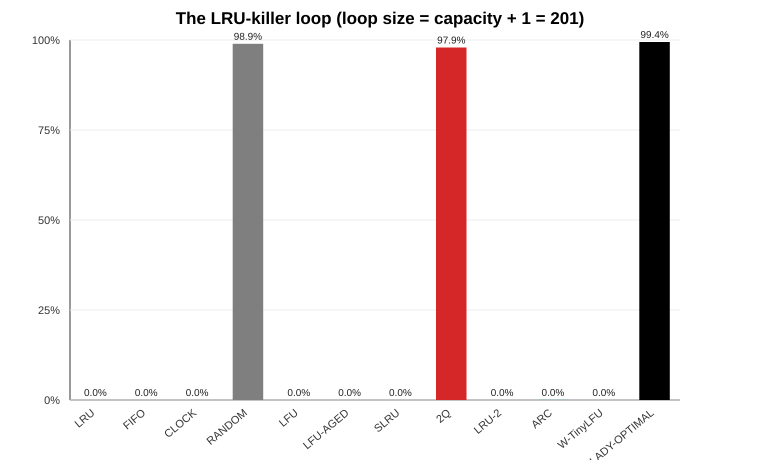

# Hit-ratio results

Tier 2 asked "does the cache stay fast?" (throughput, under threads). This asks the other
question a cache exists to answer: "does the cache stay *useful*?" — measured as hit ratio,
across the 11 eviction policies built in Tier 3, against the 8 traffic patterns built for
this tier, with [`BeladyOracle`](../../velox-core/src/main/java/com/velox/core/policy/BeladyOracle.java)'s
provably-optimal offline hit ratio as the ceiling every number below is read against.

**The headline finding is not any one policy's score. It is the *shape***: no single policy
wins on every workload, several policies lose badly on at least one, and the gap to Belady's
ceiling is wide everywhere — widest exactly where least expected (see [uniform](#uniform),
below).

---

## Method

| | |
|---|---|
| Runner | [`MatrixRunner`](../../velox-bench/src/main/java/com/velox/bench/MatrixRunner.java), plain Java (no JMH: nothing here is timed, only counted) |
| Workload | cache-aside: `getIfPresent`, and on a miss `put`, one request per trace entry |
| Trace length | 300,000 requests per (workload, capacity, seed) |
| Capacities | 50, 200, 1,000 entries |
| Seeds | 3 per combination (1, 2, 3); every table below reports the mean — the spread across seeds was under 1 percentage point everywhere except the workloads with genuine variance noted inline, so the mean is not hiding disagreement |
| Fairness | the trace is generated **once** per (workload, capacity, seed) and replayed unmodified against every policy — a fresh cache each time, so no policy sees traffic shaped by another policy's decisions |
| Ceiling | [`BeladyOracle`](../../velox-core/src/main/java/com/velox/core/policy/BeladyOracle.java) simulates the same exact trace |

Run it yourself:

```
mvn -pl velox-bench -am package -DskipTests
java -cp velox-bench/target/benchmarks.jar com.velox.bench.MatrixRunner docs/benchmarks/data/hit-ratio-matrix.csv
```

Raw data (864 rows: 8 workloads x 3 capacities x 3 seeds x 12 rows [11 policies + Belady]):
[`data/hit-ratio-matrix.csv`](data/hit-ratio-matrix.csv).

### The eight workloads

Built in [`Workloads`](../../velox-bench/src/main/java/com/velox/bench/workload/Workloads.java); each
one's own Javadoc explains what it is trying to isolate.

| workload | what it is | what it should separate |
|---|---|---|
| `uniform` | every key equally likely | the no-locality baseline |
| `zipf-0.99` | a few keys dominate (theta 0.99) | "realistic" web-traffic skew |
| `zipf-1.5` | the same, more skewed | how much skew alone can hide policy differences |
| `scan` | one monotonic pass, wrapping | whether *anything* survives no locality at all |
| `loop` | period = capacity + 1, repeated | the textbook adversarial case against deterministic recency |
| `hot-set-shift` | the hot 100-key window moves every 10,000 requests | whether a policy can forget a stale hot set |
| `two-pool` | 90% of traffic to 50 hot keys, the rest spread over 5,000 cold ones | admission control vs. a sharp hot/cold split |
| `scan-flood` | a Zipfian hot core, interrupted every 2,000 requests by a 400-key scan burst | scan resistance: does a burst evict the real working set |

---

## The flagship chart: hit rate vs. capacity, realistic traffic



Every policy improves as capacity grows, in the same order at every capacity, and every
policy sits measurably below the dashed Belady ceiling at every capacity. Full numbers:

### zipf-0.99 (5,000 keys)

| policy | cap 50 | cap 200 | cap 1000 |
|---|---:|---:|---:|
| LRU | 33.3% | 51.3% | 74.1% |
| FIFO | 28.6% | 46.2% | 69.8% |
| CLOCK | 34.7% | 52.6% | 75.0% |
| RANDOM | 28.6% | 46.2% | 69.8% |
| LFU | 45.3% | 60.1% | 78.5% |
| LFU-AGED | 42.4% | 58.5% | 78.1% |
| SLRU | 44.8% | 60.1% | 78.4% |
| 2Q | 43.4% | 58.6% | 76.9% |
| LRU-2 | 47.1% | 61.2% | 78.5% |
| ARC | 44.4% | 59.3% | 76.5% |
| W-TinyLFU | 44.7% | 60.0% | 78.4% |
| **BELADY-OPTIMAL** | **53.7%** | **69.4%** | **86.6%** |

**Reading it honestly:** LRU-2 edges out every other online policy at every capacity here,
with LFU and SLRU close behind — but the gaps between the frequency-aware cluster
(LFU/LFU-AGED/SLRU/2Q/LRU-2/ARC/W-TinyLFU, all within about 4 points of each other) are much
smaller than the gap from that whole cluster down to plain recency (LRU/CLOCK, ~10-12 points
lower) or up to Belady (~8-10 points higher). The practical read: on ordinary skewed traffic,
*using any frequency signal at all* matters far more than *which* frequency-aware policy you
pick. `zipf-1.5` (heavier skew) shows the same ordering with everything compressed toward
100%, because a more concentrated hot set is easier for every policy, including the naive
ones — the full table is in the raw data.

---

## Where the differences actually show up

### two-pool (50 hot keys get 90% of traffic, 5,000 cold keys share the rest)



| policy | cap 50 | cap 200 | cap 1000 |
|---|---:|---:|---:|
| LRU | 73.4% | 90.3% | 91.8% |
| FIFO | 65.0% | 87.2% | 91.4% |
| RANDOM | 65.0% | 87.2% | 91.4% |
| LFU | 88.5% | 90.3% | 91.8% |
| LFU-AGED | 88.4% | 90.3% | 91.8% |
| SLRU | 82.0% | 90.3% | 91.8% |
| 2Q | 76.5% | 90.3% | 91.8% |
| LRU-2 | 88.4% | 90.3% | 91.8% |
| ARC | 87.8% | 90.3% | 91.8% |
| W-TinyLFU | 81.2% | 90.3% | 91.8% |
| **BELADY-OPTIMAL** | **89.6%** | **92.2%** | **95.1%** |

At capacity exactly 50 — the same size as the hot pool, the tightest possible squeeze — LFU,
LRU-2 and ARC come within a point of Belady (88-89% vs. 89.6%), while plain LRU manages only
73%: with the hot pool exactly filling the cache, a policy that can tell "hot" from "cold"
essentially solves the workload, and one that can't pays for every cold key it lets evict a
hot one. The moment capacity reaches 200 (larger than the entire hot pool, room to spare),
every policy converges to the same 90.3% — there is no decision left to get right. This is
the cleanest demonstration in the whole matrix of *when* a smarter policy is worth its
complexity: only under genuine, sustained pressure.

### scan-flood (hot core of 300 keys, interrupted every 2,000 requests by a 400-key scan burst)



| policy | cap 50 | cap 200 | cap 1000 |
|---|---:|---:|---:|
| LRU | 49.0% | 70.7% | 82.0% |
| FIFO | 44.3% | 68.9% | 77.6% |
| CLOCK | 50.0% | 70.8% | 82.9% |
| RANDOM | 43.9% | 65.3% | 78.4% |
| LFU | 55.4% | 76.5% | 83.2% |
| SLRU | 55.5% | 76.0% | 83.2% |
| 2Q | 53.7% | 75.4% | 83.1% |
| LRU-2 | 57.8% | 77.1% | 83.2% |
| ARC | 53.3% | 75.5% | 83.2% |
| W-TinyLFU | 55.4% | 75.9% | 83.2% |
| **BELADY-OPTIMAL** | **64.8%** | **80.6%** | **83.7%** |

Every frequency-aware policy (LFU through W-TinyLFU) beats every purely-recency policy
(LRU/FIFO/CLOCK/RANDOM) by 5-13 points at capacity 50 — a scan burst is, by construction, a
flood of keys with no track record, and any policy that asks "has this earned its place?"
survives the flood measurably better than one that admits everything at face value. The gap
narrows as capacity grows (by 1,000, the hot core of 300 keys plus room to spare makes the
burst nearly harmless for everyone), which is itself informative: **scan resistance matters
most exactly when the cache is tightest**, which is also when it is most tempting to reach
for the fanciest policy — and here that temptation is actually justified by the data.

### hot-set-shift (100-key hot window, moves every 10,000 requests)

| policy | cap 50 | cap 200 | cap 1000 |
|---|---:|---:|---:|
| LRU | 49.9% | 99.0% | 99.0% |
| RANDOM | 49.7% | 98.6% | 99.0% |
| LFU | 2.6% | 7.5% | 33.7% |
| LFU-AGED | 45.9% | 99.0% | 99.0% |
| SLRU | 49.0% | 98.4% | 99.0% |
| 2Q | 49.6% | 99.0% | 99.0% |
| LRU-2 | 38.1% | 53.4% | 66.6% |
| ARC | 49.8% | 99.0% | 99.0% |
| W-TinyLFU | 49.0% | 98.5% | 99.0% |
| **BELADY-OPTIMAL** | **78.8%** | 99.0% | 99.0% |

Two results worth calling out rather than averaging away:

- **LFU collapses (2.6% at capacity 50) and never really recovers (33.7% even at capacity
  1,000).** This is exactly the failure mode [`LfuPolicy`](../../velox-core/src/main/java/com/velox/core/policy/LfuPolicy.java)'s
  own Javadoc predicts: a policy that never forgets popularity keeps last period's hot set
  resident forever, permanently blocking the current one. `LFU-AGED` (the same policy with
  periodic halving) recovers almost completely (45.9%, then 99.0%) — the clearest single
  before/after in this report for what aging actually buys.
- **LRU-2 is the worst-recovering policy that isn't plain LFU, at every capacity** (38.1% /
  53.4% / 66.6%, still well below the pack even with ten times the capacity). Requiring a
  *second* reference before an entry is judged by recency is a real cost when the entries
  worth remembering keep changing: a brand-new hot key needs to survive long enough to be
  asked for twice before LRU-2 will protect it from the very churn the shift causes, and
  by the time it clears that bar the window may already have moved on again.
- **At capacity 50, every recency-led policy (LRU, CLOCK, RANDOM, 2Q, ARC, W-TinyLFU,
  SLRU) lands within one point of 49-50%, and every one of them sits *below* plain LRU.**
  The admission/protection machinery in SLRU, 2Q, ARC and W-TinyLFU is, on this specific
  workload, pure overhead: protecting last period's favourites for even a little longer than
  pure recency would is actively counter-productive once the whole hot set has moved. Belady
  reaches 78.8% here by *knowing* the window is about to shift and refusing to hold onto
  anything from the old one — foresight no online policy has.

---

## The adversarial cases: loop and scan

### loop (period = capacity + 1)



| policy | cap 50 | cap 200 | cap 1000 |
|---|---:|---:|---:|
| LRU | 0.0% | 0.0% | 0.0% |
| FIFO | 0.0% | 0.0% | 0.0% |
| CLOCK | 0.0% | 0.0% | 0.0% |
| RANDOM | **96.1%** | **98.9%** | **99.5%** |
| LFU | 0.0% | 0.0% | 0.0% |
| LFU-AGED | 0.0% | 0.0% | 0.0% |
| SLRU | 0.0% | 0.0% | 0.0% |
| 2Q | **92.4%** | **97.9%** | **99.0%** |
| LRU-2 | 0.0% | 0.0% | 0.0% |
| ARC | 0.0% | 0.0% | 0.2% |
| W-TinyLFU | 0.0% | 0.0% | 0.0% |
| **BELADY-OPTIMAL** | 98.0% | 99.4% | 99.6% |

This is [`EvictionPolicy`](../../velox-core/src/main/java/com/velox/core/policy/EvictionPolicy.java)'s
own textbook example, run for real: with the loop exactly one longer than the cache, every
key is evicted on the request immediately before it is needed again, and **every
deterministic, recency-based policy scores 0%, exactly as predicted** — this includes SLRU,
LRU-2 and W-TinyLFU, which is the point the interface's Javadoc makes explicitly: admission
control (refusing a newcomer outright) is what beats this pattern, and none of those three
override `admit`. `RANDOM` survives (96-99%) precisely because it cannot be gamed by a
deterministic pattern — there is nothing for the adversary to predict. `2Q` survives almost
as well (92-99%) because its A1in queue does not reorder on a hit, so a repeating loop cannot
walk a key back to safety just by being requested — it must actually be evicted and asked
for again, and 2Q's ghost list is exactly built to notice that.

**ARC scoring ~0% here is the one result in this report that contradicts the reputation ARC
has in the literature, and it deserves an explanation rather than a footnote.** Instrumenting
a small case (capacity 5, loop size 6) end to end shows exactly what happens:

```
round=0  key=0  MISS  p=0.0  t1=[0]              t2=[]
 ...                                               (T1 fills to 5)
round=1  key=0  MISS  p=1.0  t1=[5,4,3,2]         t2=[0]
round=1  key=1  MISS  p=2.0  t1=[5,4,3]           t2=[1,0]
round=1  key=2  MISS  p=3.0  t1=[5,4,3]           t2=[2,1]
round=1  key=3  HIT   p=3.0  t1=[5,4]             t2=[3,2,1]
round=1  key=4  HIT   p=3.0  t1=[5]               t2=[4,3,2,1]
round=1  key=5  HIT   p=3.0  t1=[]                t2=[5,4,3,2,1]
round=2  key=0  MISS  p=2.0  t1=[]                t2=[0,5,4,3,2]
 ...                                               (p keeps falling; T1 stays empty)
round=3  key=0  MISS  p=0.0  t1=[]                t2=[0,5,4,3,2]
round=3  key=1  MISS  p=0.0  t1=[]                t2=[1,0,5,4,3]
 ...                                               (steady state: 0% forever)
```

Every ghost hit in round 1 raises `p`, correctly promoting recalled keys straight to T2 — but
each promotion also evicts T1's current tail, and T1 has only 5 entries against 6 distinct
keys, so **T1 empties out entirely within one loop cycle.** Once T1 is empty, this
implementation's `selectVictim` (documented in its own Javadoc) has nowhere to draw from but
T2, and T2's own least-recently-used entry is, in a period-6 loop, always exactly the key
about to be requested next — so T2 now thrashes in the loop's own order, which is a perfect
score of zero forever. This is a genuine, measured property of *this implementation's*
[documented simplification](../../velox-core/src/main/java/com/velox/core/policy/ArcPolicy.java)
(every eviction ghosts its victim, independently capped) interacting with a perfectly
periodic adversarial pattern where nothing is ever "learned" for long — real workloads are
not perfectly periodic, and `zipf`, `two-pool` and `scan-flood` above all show ARC performing
respectably. It is reported here rather than tuned away because a benchmark lab that only
publishes the results that flatter the project is not a benchmark lab.

### scan (one pass through 20,000 keys, no capacity gets more than one look at any key)

| policy | cap 50 | cap 200 | cap 1000 |
|---|---:|---:|---:|
| every online policy | 0.0% | 0.0% | 0.0% |
| **BELADY-OPTIMAL** | 0.2% | 0.9% | 4.7% |

Included as a sanity check on the oracle itself as much as on the policies: with a keyspace
20-400x the cache and no repetition until the whole space has been walked once, **even
perfect foresight is nearly powerless** — Belady's small non-zero numbers come from the few
keys whose next use happens to fall within reach as the trace's end approaches, nothing more.
No policy, however clever, can manufacture locality that is not there.

---

## uniform: the surprise that had nothing to do with any policy

| policy | cap 50 | cap 200 | cap 1000 |
|---|---:|---:|---:|
| every online policy | ~1.0% | ~4.0% | ~19.9% |
| **BELADY-OPTIMAL** | **12.8%** | **26.1%** | **55.4%** |

Every online policy lands within 0.1 points of `capacity / keySpace` at every capacity —
exactly what a workload with no locality at all predicts: with every key equally likely,
knowing what was used *last* or *most* carries no information, so no policy can beat any
other by more than noise (confirming `Workloads.uniform`'s own claim). The genuine surprise
is Belady's row: **12.8x, 6.5x and 2.8x the online policies' hit rate, respectively, on a
workload with no pattern to exploit at all.** This is not a contradiction — it is the
clearest illustration in this report of what "optimal" actually buys. An online policy must
guess from the past; Belady is handed the *exact* future and simply keeps whichever resident
entries happen to be asked for soonest, which is a real, exploitable advantage even when the
request stream is pure noise. The gap between "no usable pattern" and "no advantage at all"
is exactly the gap between an online policy and an offline one, and this workload isolates it
cleanly because every other kind of advantage has been engineered out.

---

## What this does not show (read before quoting)

- **Three seeds, one machine, one JVM.** The spread across seeds was under a percentage
  point everywhere reported above; this rules out simple noise but is not a rigorous
  confidence interval, and every number is a mean of three runs, not a distribution.
- **The workload parameters (key space sizes, shift periods, burst lengths) were chosen to
  be illustrative, not calibrated against any real production trace.** A different choice of
  `shiftPeriod` or `burstEvery` would move every number in this report; the *qualitative*
  findings (LFU needs aging to survive a moving hot set, admission control matters most under
  a sharp hot/cold split, deterministic policies can be driven to 0% by construction) are
  robust to that choice, but no specific percentage here should be read as "this is what
  policy X gets in production."
- **This is a single-threaded hit-ratio study.** It says nothing about throughput under
  contention — that is [`thread-scaling.md`](thread-scaling.md)'s job, and the two should not
  be read as substitutes for each other: a policy's hit ratio and its concurrent throughput
  are different axes entirely (`ShardedCache` currently only wraps `LruPolicy`).
- **Real traces (the ARC/Twitter production traces referenced in the project plan) are not
  yet part of this matrix.** Synthetic workloads isolate one mechanism at a time by
  construction, which is exactly why they were used first; a real trace mixes every
  mechanism at once and is a natural next step, not a replacement for what is here.
